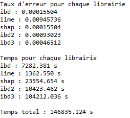

# comparateurs_explicateurs
Comparateurs des librairies d'explicabilité sur différents jeux de données.
Les librairies présentes sont LIME, SHAP, iBreakDown, iBreakDown2 et iBreakDown3. Ces deux dernières sont des modifications que nous avons apportées, vous trouverez la documentation dans iBreakDown2 dans ce git. 
iBreakDown3 se base sur iBreakDown2 et prend en compte les triplets de variables.

Le comparateur ne marche uniquement que pour les classifications binaires. Il retourne les taux d'erreurs de chaque librairie pour un jeu de données et modèles prédictifs choisis, et écrit également ces scores dans un fichier avec les temps d'exécutions.

# Utilisation
Pour utiliser le comparateur, vous devez tout d'abord importer le fichier "comparateur.py" qui va faire appel aux différents évaluateurs.

Une fois que vous avez effectué les traitements nécessaires sur votre jeu de données, vous pouvez utiliser le comparateur de cette façon

```sh
import comparateurs_explicateurs.comparateur as comp
result = comp.comparateur(name_output, data, y, feature_names, name_model, n)
```

Les variables correspondent à :
- name_output : string : le nom du fichier que le comparateur va créer
- data : array : le jeu de données avec les variables explicatives
- y : array : les variables à expliquer
- features_names : list : les noms des variables 
- name_model : string : le nom du modèle prédictif voulu
- n : integer : le nombre de validations croisées à effectuer

Le comparateur retourne son résultat dans result qui est une liste.

Vous trouverez des exemples de son utilisation dans le dossier exemple.

# Interprétation

Prenons un exemple de résultat du comparateur



Les taux d'erreurs sont d'abord indiqués. Plus le score est faible meilleure est l'explicabilité de la librairie.
Puis les temps d'exécutions de chaque évaluateur sont affichés.
Le temps total est la somme de tous les temps d'exécutions des évaluateurs + le temps d'exécution du déroulement du code. 
